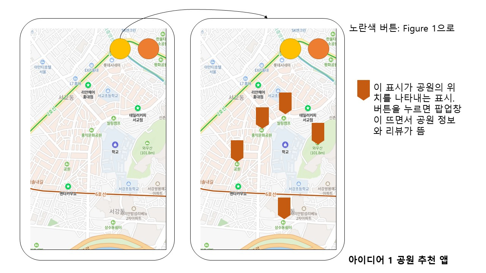
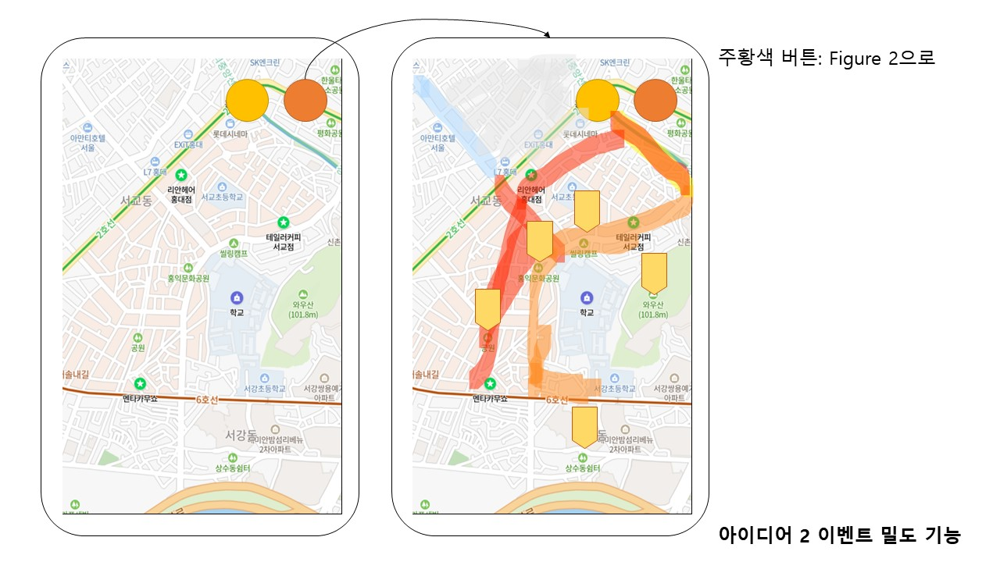
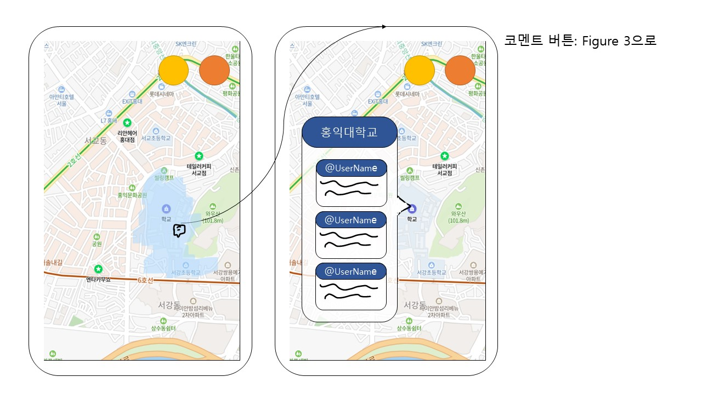

# Decide : 아이디어 결정하기
Decide는 프로토타입으로 발전시킬 아이디어를 확실히 하는 단계입니다.
## 후보 아이디어
- 모든 아이디어를 나열합니다. 
### 장점
- 모든 아이디어에 대해 사용자, 기술적 가능성, 사회 문제 해결 가능성을 고려하여 장점을 작성합니다.
### 단점
- 모든 아이디어에 대해 사용자, 기술적 가능성, 사회 문제 해결 가능성을 고려하여 단점을 작성합니다.
### 피드백
- 모든 아이디어에 대해 사용자, 기술적 가능성, 사회 문제 해결 가능성을 고려하여 피드백을 작성합니다.
## 최종 아이디어
- 최종 결정된 아이디어와, 결정 사유를 간략하게 정리하여 서술해 주세요. 

# 후보 아이디어
## 아이디어 1. 공원 추천 앱
카페 추천 지도는 많아도 공원 추천 지도가 많지는 않다. 융합의 공간인 공원을 추천하고 표시하는 지도가 있다면 좋을 것이다.
공원 뿐만 아니라, 청년 쉼터 등의 대학생들이 무료로 이용할 수 있는 공간을 추천하고 안내하는 서비스를 제공하면, 더 다양한 정보를 제공할 수 있을 것이다.
### 장점
- 카페라는 유상의 제한적 공간에서 벗어나, 무상으로 이용할 수 있는 공간을 찾을 수 있다.
- 공원, 청년 쉼터 등의 위치 정보를 띄우는 것은, 아마도 카페 추천 지도를 만드는 방식과 크게 다르지 않을 것이라 예상한다. 이미 카페 추천 지도 및 앱은 비교적 정보가 많이 존재하니, 이 기술을 응용한다면 공원, 청년 쉼터 등의 정보를 받아올 수 있을 것으로 예상된다.
- 사회가 점차 각 단위 집단의 폐쇄화가 일어나는데, 이는 개인은 자신이 속한 집단 내부에서만 머무는 시간이 점차 늘어나게 되기 때문이다. 이는 도시 문제를 고려할 때도 고려해야 하는 사항이 되는데, 슬럼화된 지역의 사람들은 슬럼가에만 머무르고, 강남 등의 중산층 이상의 사람들이 주로 사는 지역은 또 그 지역 내부적인 폐쇄성을 갖기 때문이다.
한편 이를 해결하기 위한 방안이 공원이라 해도, 한국은 지역 특성상 공원이 많지가 않다. 특히 강남이 그러한데, 강남은 매우 고밀화된 지역임에도 불구하고, 어쩌면 매우 고밀화된 지역이기에 여유있게 즐길 수 있는 공간인 공원이 없다. 만약 강남에서 일정 시간 이상 점유할 수 있는 공간을 가지려면 카페를 가야 한다. 여유있게 있을 수 있는 공간이 별로 없다는 것은 카페가 점차 늘어나고 있는 이유이기도 하다.
찾아보면 숨겨진 공원들의 위치를 적극적으로 표시하고 이를 권장한다면, 공원에 대한 수요가 늘어나기에 공원의 필요성이 대중적으로 확산될 수가 있고, 이러한 공간을 적극적으로 이용하는 사람들이 많아질수록 단절에 대한 도시 문제를 해결하는 방안이 될 수 있다.

### 단점
- 공원의 접근성이 과연 카페보다 좋은가에 대한 생각을 신중히 제고해볼 필요가 있다. 공원은 카페에 비해 한정된 수와 지역에 따라 공원이 없는 지역도 있을 수 있기에, 특히나 매우 고밀화된 지역에 사는 사람들, 그리고 공원으로부터 멀리 떨어진 사람들은 공원에 대한 접근성이 카페에 비해 훨씬 떨어질 수 있다.
- 특히 공원에서 멀리 떨어진 사람들 중 이동 수단의 부재로 문제를 겪을 수 있다. 개인 이동 수단이 없고, 대중 교통이 활발하게 연결되지 아니한 지역에 사는 사람들은 공원에 대한 접근성이 카페에 비해 훨씬 떨어질 수 있다.
- 또한 일부 공원은 24시간 이용이 불가능하다. 공원 이용 시간에 공원을 이용하지 못하는 사람들에게 접근성이 떨어진다.
- 공원은 일부 사람들에게 카페보다 덜 매력적인 선택이 되는데, 특히 카페와 같이 조용하고 정적인 공간을 원하는 사람에게 각종 도시 소음과 어린아이들이 만들어내는 소리들, 새의 지저귐 등의 자연의 소리 등이 방해가 될 수 있기 때문이다.

그렇기에 공원이 도시의 파편화를 막을 수 있는 대안이라 생각해도, 이에 대한 한계를 파악하고 이를 개선해야 할 추가적인 아이디어를 떠올릴 필요가 있다.

### 피드백
- 공원에 대한 접근성이 일부 사람들에게 카페에 비해 떨어진다는 점을 고려하여, 공원에 대한 접근성을 높이는 방법을 고민해보자.
- 서울과 다르게 지방의 경우 공원에 대한 접근성이 더 떨어질 수 있다. 이에 대한 추가적인 아이디어를 고민해보자.
- 매우 고밀화된 지역과 저밀화된 지역의 공원 접근성이 다를 수 있다. 이에 대한 추가적인 아이디어를 고민해보자.
- 공원, 청년 쉼터 외에 필요한 다른 장소들을 표시하는 것도 부가 기능으로 들어갈 만 하다. 예를 들어 화장실을 표시해주는 것. 특히 깨끗한 화장실을 강력하게 선호하는 사람들의 경우, 단순히 화장실 정보 뿐만 아니라 이에 대한 청결도도 표시할 수가 있을 것 같다. 이에 대한 아이디어는 아이디어 4. 추가 아이디어에서 계속.

## 아이디어 2. 이벤트 밀도
이벤트 밀도를 색깔별로 표시하여 이를 지도 위에 나타내보자. 이벤트 밀도가 높을수록 매력적인 공간이며, 내 주위에 어느 지역이 매력적인 공간인지 알 수 있다. 한 번 주위에 이벤트 밀도가 높은 거리들을 직접 가보는 것은 어떨까?

### 장점
- 이벤트 밀도가 높은 곳을 표시함으로써, 지역 속 융합의 공간을 효과적으로 파악할 수 있다.
- 기술적 구현 난이도의 경우, 구글 맵 API를 활용해 상점, 카페, 음식점 등의 조건에 맞는 시설들의 개수를 파악하여 이벤트 밀도를 계산하는 것이 가능해보인다.

### 단점
- 이미 이벤트 밀도가 높은 지역은 잘 알려져 있고, 사람들이 많이 찾는 지역일 가능성이 높다.
- 이벤트 밀도가 낮은 지역의 경우 오히려 이 기능으로 인한 혜택보다 불이익을 받을 수 있다.
- 이벤트 밀도가 높다고 해서 정말로 그 공간이 매력적인 공간이라는 것을 보장할 수 없다.
- 조건에 맞는 출입문을 잘 찾아야 한다. 예를 들어서 일반 회사의 업무 건물은 이벤트 밀도의 출입문으로 계산할 수 없다. 이러한 조건들을 다 따져서 분류해야 한다.
- 이벤트 밀도는 이미 정해진 정보이고 정적인 정보이다. 따라서 실시간으로 변화하는 정보를 반영하지 못한다.

### 피드백
- 이벤트 밀도가 낮은 지역과 높은 지역이 한 눈에 보이도록 지도 위에 색깔로 표시하자.
- 단 이벤트 밀도가 낮은 지역을 어떻게 활용할 지에 대해서도 논의해보자.
- 이벤트 밀도 아이디어와 아이디어 1의 공원 추천 앱, 그리고 아이디어 2의 커뮤니티 시스템과의 상호작용성을 생각해봐야 한다.
- 이벤트 밀도와 공원 지도 등을 같이 혹은 따로 표시하는 방안에 대해서 논의해야 함.
- 이벤트 밀도는 이미 정해진 정보이고 정적인 정보이다. 동적이고 실시간으로 바뀌는 정보는 반영하지 못한다. 이에 대한 개선점으로 아이디어 3 커뮤니티 시스템을 활용해보는 건 어떨까?

## 아이디어 3. 공간 기반 커뮤니티 시스템
위치 정보를 기반으로 한 커뮤니티 시스템으로, 트위터 형태의 게시물들 속 컨텐츠가 그 공간의 수치적 정보만으로는 알 수 없는 성격과 분위기를 알려줄 수 있다.
또한 지역을 구분으로 한 커뮤니티는 세대 간, 혹은 주제 별로 구분된 커뮤니티에 비해 더 다양한 사람들을 포괄적으로 수용할 수 있다. 이러한 특성은 융합의 공간이 될 수 있다. 한편 아무 구분없는 커뮤니티는 그저 정보의 홍수이자 방대한 양의 바다일 뿐이다. 따라서 어느정도의 공통된 속성을 갖는 구분이 필요하다. 지역은 그러한 구분을 해줄 것이다.
즉 정보의 홍수로 가는 것을 막기 위한 구분과, 단절되고 폐쇄적인 방향으로 가는 것을 막기 위한 다양성 사이의 균형을 잘 맞추어야 하는데, 공간 기반 커뮤니티 시스템을 하나의 대안책으로 제시할 수가 있다.
또한 핫 게시물과 같은 기능을 쓴다면, 다른 지역들의 핫 게시물을 볼 수 있게 하여 다른 지역에는 이러한 일들이 있구나 라는 것을 알 수 있게 해준다.

### 장점
- 이벤트 밀도는 정적이고 고정된 정보이다. 반면 커뮤니티는 동적이고 실시간의 정보를 반영할 수 있다. 예를 들어 몇 날 몇 시에 어디에서 버스킹이 있다 이런 정보는 이벤트 밀도로는 알기 힘든 정보이다.
- 커뮤니티 시스템은 응용할 수 있는 분야가 무궁무진하다.

### 단점
- 사람을 대상으로 하는 커뮤니티 시스템은 언제나 다양한 문제점과 위험성을 갖고 있다.
- 특히 지역 갈등을 부추길 수 있다는 점을 생각해야 한다.
- 핫 게시물의 경우, 그 기준을 추천수나 조회수의 절댓값으로 한다면 예를 들어 인구가 많은 지역은 핫게시물로 선정되기 쉬운 반면 인구가 적은 지방의 경우 선정되기 힘들 수 있다. 또는 이 기준을 인구에 비례하여 준다면, 서울은 추천수가 많은데도 주목받지 아니하고 인구가 적은 지방에서 태그된 글은 낮은 추천수로도 핫게시물 등으로 선정되는 등의 문제점이 있을 수 있다. 이러한 기준을 잘 세워야 한다.
- 커뮤니티 서비스는 그 이용자가 충분히 확보가 되었을 때 효과가 있다. 이용자가 없다면 의미가 없는 기능이다.
- 구현 난이도가 매우 높을 것으로 예상된다. 커뮤니티 시스템은 무조건 개인화 서비스가 되어야 하기에, 일단 로그인 기능을 구현해야 할 것이고, 개인 맞춤형 서비스(마이페이지, 내가 쓴 글 보기 등)를 제공해야 한다. 그리고 커뮤니티 시스템은 실시간으로 여러 사람들이 쓴 글을 연동해서 봐야 한다. 그런데 우리는 그러한 기능을 구현해본 경험이 많지 않다. 그래서 구현 난이도가 아이디어 1, 2에 비해 매우 높을 것으로 예상된다.

### 피드백
- AI를 이용해서 커뮤니티 게시물들을 분석하는 건 어떨까? 
    1. NLP를 통해 사람들이 어느 순간에 자주 찾는 키워드, 예를 들어 어느 순간 어느 위치에서 버스킹이라는 단어가 많이 등장하면 그 위치에 버스킹과 같은 이벤트가 있을 확률이 높구나라는 걸 파악해서 표시해줄 수 있을 듯
    2. 또 게시물 분석을 통해서 그 공간의 키워드나 분위기를 파악할 수도 있다.
- 굳이 해당 위치에 있지 않더라도 멀리 떨어진 곳에서도 해당 위치를 태그하여 게시물을 작성할 수 있게 하는 게 좋을 것 같고, 이에 대해 고려해보자. 만약 어느 위치도 태그하지 않았다면 자동적으로 사용자가 글을 작성한 위치로 태그하는 형식
- 또한 우리가 직접 이벤트를 만들 수도 있다. 이벤트 밀도가 적은 지역의 경우, 우리가 직접 어떠한 행사, 또는 이벤트를 주최하여 그 공간에 대한 관심도를 높이는 형식으로 동적인 이벤트를 형성할 수 있다.

# 최종 아이디어
아이디어 1, 2, 3을 적절하게 모두 섞어서 구현하자. 일단 구현 난이도가 비교적 낮은 아이디어 1, 2를 우선적으로 구현하고, 구현 난이도가 높은 3은 추후에 구현할 것을 결정하자.
AI를 활용한 분석은 아이디어 3 커뮤니티 서비스를 구현하기로 결정을 하면 그 후에 생각하자.

## 각 아이디어에 대한 기본 디자인
1. 아이디어 1. 공원 추천 지도

2. 아이디어 2. 이벤트 밀도 지도

3. 아이디어 3. 공간 기반 커뮤니티
